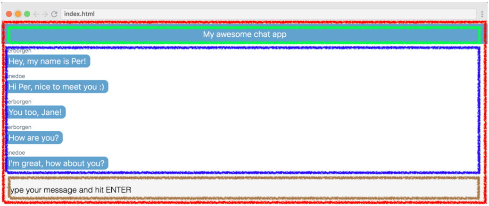

# React App in 10 min



## Chat App 



### 3 components

* Title
* MessageList
* SendMessageForm

### Root Element



* Title
* MessageList
* SendMessageForm

```javascript
class App extends React.Component {
  render() {
    return (
      <div className="app">
        <Title />
        <MessageList />
        <SendMessageForm />
      </div>
    )
  }
}
```



The chat messages will need to be stored inside the _state_ of this `App` component. This will enable us to access the messages through `this.state.messages`, and thus pass them around to other components.

```javascript
class App extends React.Component {
  constructor() {
    super()
    this.state = {
       messages: DUMMY_DATA
    }
  }
  render() {
    return (
      <div className="app">
        <MessageList messages={this.state.messages} />
        <SendMessageForm />
     </div>
    )
  }
}
```



```javascript
const DUMMY_DATA = [
  {
    senderId: "perborgen",
    text: "who'll win?"
  },
  {
    senderId: "janedoe",
    text: "who'll win?"
  }
]
```



```javascript
class MessageList extends React.Component {
  render() {
    return (
      <ul className="message-list">                 
        {this.props.messages.map(message => {
          return (
           <li key={message.id}>
             <div>
               {message.senderId}
             </div>
             <div>
               {message.text}
             </div>
           </li>
         )
       })}
     </ul>
    )
  }
}
```



### Connecting API \(fetch\)

#### Chatkit API



We get information like this from the site

```javascript
const instanceLocator = "v1:us1:dfaf1e22-2d33-45c9-b4f8-31f634621d24"
const testToken = "https://us1.pusherplatform.io/services/chatkit_token_provider/v1/dfaf1e22-2d33-45c9-b4f8-31f634621d24/token"
const username = "perborgen"
const roomId = 9796712
```

#### 



`componentDidMount()` is typical place when connecting React.js components to API’s.

```javascript
componentDidMount() {
  const chatManager = new Chatkit.ChatManager({
      instanceLocator: instanceLocator,
      userId: username,
      tokenProvider: new Chatkit.TokenProvider({
        url: testToken
      })
   })
```



```javascript
componentDidMount() {
  const chatManager = new Chatkit.ChatManager({
    // ...
   })
   
   chatManager.connect().then(currentUser => {
      currentUser.subscribeToRoom({
        roomId: roomId,
        hooks: {
          onNewMessage: message => {
            this.setState({
              messages: [...this.state.messages, message]
            })
          }
        }
      })
   })
}
```

This gives us access to the `currentUser` object, which is the interface for interacting with the API.

> Note: As we’ll need to use`currentUser` later on, well store it on the instance by doing `this.currentUser = currentUser`.

Then, we’re calling `currentUser.subscribeToRoom()` and pass it our `roomId`and an `onNewMessage` hook.

The `onNewMessage` hook is triggered every time a new message is broadcast to the chat room. So every time it happens, we’ll simply add the new message at the end of `this.state.messages`.

This results in the app fetching data from the API and then rendering it out on the page.


















## Handling User Input



```javascript
class SendMessageForm extends React.Component {

  render() {
    return (
      <form
        className="send-message-form">
        <input
          onChange={this.handleChange}
          value={this.state.message}
          placeholder="Type your message and hit ENTER"
          type="text" />
      </form>
    )
  }
}
```

We’re doing two things:

1. Listening for user inputs with the `onChange` event listener, so that we can trigger the `handleChange` method
2. Setting the `value` of the input field explicitly using `this.state.message`



```javascript
class SendMessageForm extends React.Component {
  handleChange(e) {
    this.setState({
      message: e.target.value
    })
  }
  
  render() {
    return (
      <form
        className="send-message-form">
        <input
          onChange={this.handleChange}
          value={this.state.message}
          placeholder="Type your message and hit ENTER"
          type="text" />
      </form>
    )
  }
}
```

The connection between these two steps is found inside the `handleChange`method. It simply updates the state to whatever the user types into the input field:

This triggers a re-render, and since the input field is set explicitly from the state using `value={this.state.message}`, the input field will be updated.

So even though the app feels instant for the user when they type something into the input field, **the data actually goes via the state before React updates the UI.**



```javascript
class SendMessageForm extends React.Component {
  constructor() {
      super()
      this.state = {
         message: ''
      }
      this.handleChange = this.handleChange.bind(this)
  }
  
  handleChange(e) {
    this.setState({
      message: e.target.value
    })
  }
  
  render() {
    return (
      <form
        className="send-message-form">
        <input
          onChange={this.handleChange}
          value={this.state.message}
          placeholder="Type your message and hit ENTER"
          type="text" />
      </form>
    )
  }
}
```



## Sending Messages



```javascript
render() {
    return (
      <form
        onSubmit={this.handleSubmit}
        className="send-message-form">
        <input
          onChange={this.handleChange}
          value={this.state.message}
          placeholder="Type your message and hit ENTER"
          type="text" />
      </form>
    )
  }
```



Here, we’re calling the `sendMessage` prop and passing in `this.state.message`as a parameter.

Secondly,, we’re clearing out the input field by setting `this.state.message` to an empty string.

```javascript
handleSubmit(e) {
  e.preventDefault()
  this.props.sendMessage(this.state.message)
  this.setState({
    message: ''
  })
}
```



```javascript
class SendMessageForm extends React.Component {
  constructor() {
    super()
    this.state = {
      message: ''
    }
    this.handleChange = this.handleChange.bind(this)
    this.handleSubmit = this.handleSubmit.bind(this)
  }
  
  handleChange(e) {
    this.setState({
      message: e.target.value
    })
  }
  
  handleSubmit(e) {
    e.preventDefault()
    this.props.sendMessage(this.state.message)
    this.setState({
      message: ''
    })
  }
  
  render() {  
     return (
      <form
        onSubmit={this.handleSubmit}
        className="send-message-form">
        <input
          onChange={this.handleChange}
          value={this.state.message}
          placeholder="Type your message and hit ENTER"
          type="text" />
      </form>
    )
  }
}
```



## Sending the messages to Chatkit

Sending message is done up in App component.



```javascript
sendMessage(text) {
  this.currentUser.sendMessage({
    text,
    roomId: roomId
  })
}
```



The final step is to pass this down to the `<SendMessageForm>` component as a prop:

```javascript
/* App component */
  
render() {
  return (
    <div className="app">
      <Title />
      <MessageList messages={this.state.messages} />
      <SendMessageForm sendMessage={this.sendMessage} />
  )
}
```

And with that, we’ve passed down the handler so that `SendMessageForm` can invoke it when the form is submitted.



## Title Component

```javascript
const Title = () => <p class="title">My awesome chat app</p>
```


